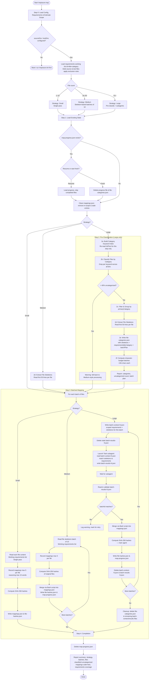

# ReqTracer Commands

## `/reqtracer.map` — Requirement-to-Code/Test Mapping Flow

```mermaid
flowchart TD
    A([Start /reqtracer.map]) --> B[Step 0: Load Config, Requirements & Estimate Scope]
    B --> B1{sourceDirs / testDirs configured?}
    B1 -- No --> ABORT([Abort: run /reqtracer.init first])
    B1 -- Yes --> B2[Load requirements working list id+title+category\nGlob source & test files apply exclusion rules]
    B2 --> B3{File count}
    B3 -- 1–15 --> SMALL[Strategy: Small\nSingle pass]
    B3 -- 16–50 --> MEDIUM[Strategy: Medium\nSkeleton-based batches of 10]
    B3 -- 51+ --> LARGE[Strategy: Large\nPre-classify + subagents]

    SMALL & MEDIUM & LARGE --> C[Step 1: Load Existing State]
    C --> C1{map-progress.json exists?}
    C1 -- Yes --> C2{Resume or start fresh?}
    C2 -- Resume --> C3[Load progress, skip completed files]
    C2 -- Fresh --> C4[Delete progress file & file-categories.json]
    C1 -- No --> C5[Clean mappings.json: remove in-scope & stale entries]
    C3 & C4 --> C5

    C5 --> D{Strategy?}
    D -- Small --> F
    D -- Medium --> SKEL[2d: Extract File Skeletons\nRead first 50 lines per file]
    D -- Large --> E

    subgraph PRE ["Step 2: Pre-Classification (Large only)"]
        E[2a: Build Category Keyword Index\nRe-read fullText for this step only] --> E1[2b: Classify Files by Category\nGrep per keyword across all dirs]
        E1 --> E2{> 40% uncategorized?}
        E2 -- Yes --> E3[Warning: fall back to Medium-style processing]
        E2 -- No --> E4[2c: Filter & Group by primaryCategory]
        E4 --> E5[2d: Extract File Skeletons\nRead first 50 lines per file]
        E5 --> E6[2e: Write file-categories.json\nwith skeletons + requirementsByCategory + batchPlan]
        E6 --> E7[2f: Compute character-budget batches\n~24k chars each]
        E7 --> E8[Report: categories, uncategorized count, batch plan]
    end

    E3 --> F
    E8 --> F
    SKEL --> F

    subgraph MAP ["Step 3: Batched Mapping"]
        F[For each batch of files] --> F1{Strategy?}

        F1 -- Small --> S1[Read each file content\nWorking requirements list\nSingle pass]
        S1 --> S2[Record mappings max 5 per file\nreasoning max 15 words]
        S2 --> S3[Compute SHA-256 hashes]
        S3 --> S4[Write mappings.json & file-hashes.json]

        F1 -- Medium --> M1[Read file skeletons batch of 10\nWorking requirements list]
        M1 --> M2[Record mappings max 5 per file]
        M2 --> M3[Compute SHA-256 hashes of original files]
        M3 --> M4[Merge via Bash script into mappings.json\nWrite file-hashes.json & map-progress.json]
        M4 --> M5{More batches?}
        M5 -- Yes --> M1
        M5 -- No --> G

        F1 -- Large --> L0[Write batch-context-N.json\nscoped requirements + skeletons for this batch]
        L0 --> L1[Delete stale batch-results-N.json]
        L1 --> L2[Launch Task subagent:\nread batch-context-N.json\nmatch skeletons to requirements\nwrite batch-results-N.json]
        L2 --> L3[Wait for subagent]
        L3 --> L4[Read & validate batch-results-N.json]
        L4 --> L5{batchId matches?}
        L5 -- No --> L6[Log warning, mark for retry]
        L5 -- Yes --> L7[Merge via Bash script into mappings.json]
        L7 --> L8[Compute SHA-256 hashes — main agent]
        L8 --> L9[Write file-hashes.json & map-progress.json]
        L9 --> L10[Delete batch-context-N.json & batch-results-N.json]
        L10 --> L11{More batches?}
        L11 -- Yes --> L0
        L11 -- No --> L12[Cleanup: delete file-categories.json\n& remaining batch-context/results files]
        L12 --> G
    end

    S4 --> G
    G[Step 4: Completion]
    G --> G1[Delete map-progress.json]
    G1 --> G2[Report summary: strategy, batches, files classified+uncategorized\nmappings code+test, requirements coverage]
    G2 --> G3([Done])
```
